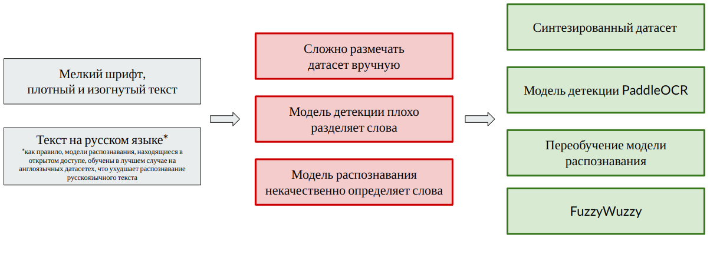
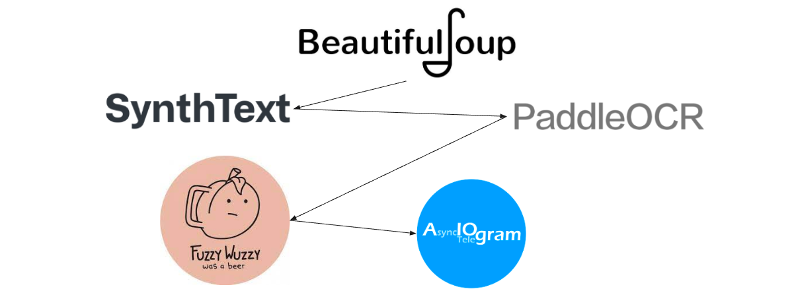

<h1 align="center">Nutrition Assistant</a></h1>

   
Проверяет состав продуктов, помогая следить за качеством питания и облегчая процесс соблюдения диеты. 

<h1 align="left">Описание проекта</a></h1>

Telegram-бот для распознавания входящих в продукт ингредиентов по фотографии состава с целью обнаружения нежелательных пищевых добавок*. Пользователь может составить собственный стоп-лист для контроля употребления определенных ингредиентов, например, по причине аллергии или соблюдения диеты. Бот проверит не только добавленный ингредиент, но и его производные ("арахис" -> "арахисовый").   

Над проектом работали: [@Rushaniia Ishkulova](https://github.com/rrishkulova), [@Tatiana Maslennikova](https://github.com/Tanchik24), [@Alexandr Kozhevnikov](https://github.com/Sand478). 

*\*Перечень нежелательных пищевых добавок Е составлен по материалам Центра независимой экологической экспертизы "КЕДР", а также по данным INFO Минздрав.*

   

   

<h1 align="left">Сложности в реализации проекта и их решение</a></h1> 

   

   

<h1 align="left">Стек</a></h1>

   

   

- 
  * Парсинг составов продуктов с сайта магазина "Перекресток" с помощью библиотеки [BeautifulSoup](https://github.com/rrishkulova/Nutrition_assistant/tree/main/0.Parsing). 
  * Предобработка спарсенных данных для дальнейшего создания словаря, на основании которого генерировался текст в синтетическом датасете, а также позже осуществлялась корректировка распознанных слов.    
  * Создание синтетического датасета для обучения модели распознавания при помощи [SynthText](https://github.com/rrishkulova/Nutrition_assistant/tree/main/1.SynthText).   
  * Дообучение модели распознавания [PaddleOCR](https://github.com/rrishkulova/Nutrition_assistant/tree/main/2.PaddleOCR) на сгенерированном русскоязычном датасете.   
  * Для того, чтобы в дальнейшем распознанные слова можно было сравнить с личным стоп-листом пользователя и списком нежелательных пищевых добавок, воспользовались библиотекой нечеткого сравнения слов **FuzzyWuzzy**.    
  * Через библиотеку [aiogram](https://github.com/rrishkulova/Nutrition_assistant/tree/main/3.Bot) создали Telegram Bot.
