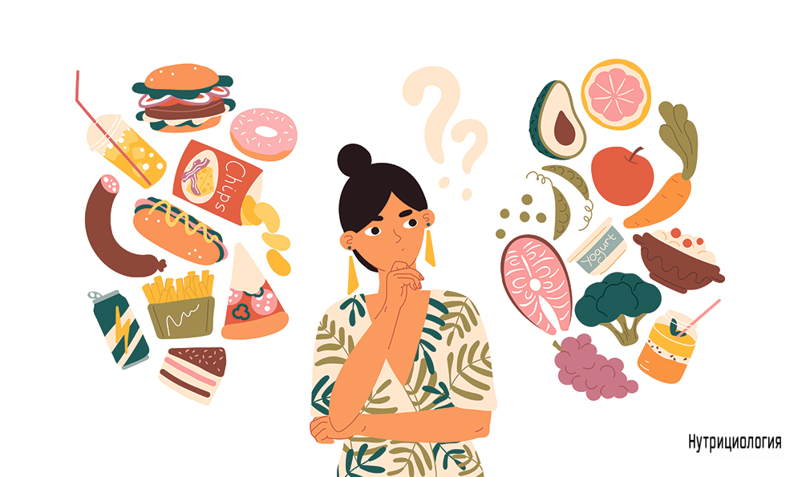
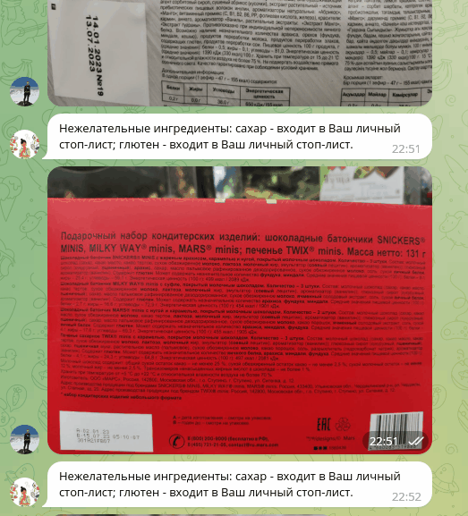

<h1 align="center">Nutrition Assistant</a></h1>

   

Проверяет состав продукта, помогая следить за качеством питания и облегчая процесс соблюдения диеты.   

<h1 align="center">Описание</a></h1>

Telegram-бот для распознавания входящих в продукт ингредиентов по фотографии состава, с целью обнаружения нежелательных добавок*. Пользователь может составить собственный стоп-лист ингредиентов, употребление которых он хочет контролировать, например, при наличии аллергии или соблюдении диеты. Бот проверит не только добавленный ингредиент, но и его производные ("арахис" -> "арахисовый").   

Над проектом работали: [@Rushaniia Ishkulova](https://github.com/rrishkulova), [@Tatiana Maslennikova](https://github.com/Tanchik24), [@Alexandr Kozhevnikov](https://github.com/Sand478).

*Перечень нежелательных пищевых добавок Е составлен по материалам Центра независимой экологической экспертизы "КЕДР", а также по данным INFO Минздрав.

   

   

Используемые библиотеки: *BeautifulSoup, SynthTest, PaddleOCR, FuzzyWuzzy, Aiogram.*

