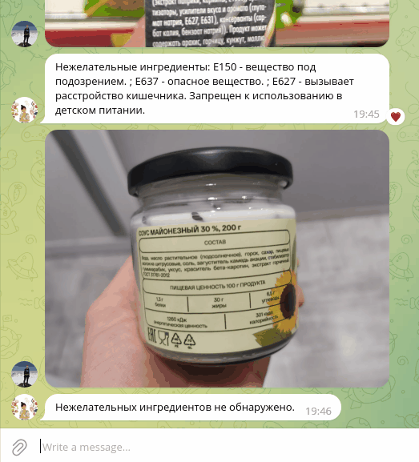

**Nutrition Assistant**

   

Telegram-бот для распознавания входящих в продукт ингредиентов по фотографии состава, с целью обнаружения нежелательных добавок*. Пользователь может составить собственный стоп-лист ингредиентов, употребление которых он хочет контролировать, например, при наличии аллергии или соблюдении диеты. Бот проверит не только добавленный ингредиент, но и его производные ("арахис" -> "арахисовый").

Используемые библиотеки: *BeautifulSoup, SynthTest, PaddleOCR, FuzzyWuzzy, Aiogram.*
*Перечень нежелательных пищевых добавок Е составлен по материалам Центра независимой экологической экспертизы "КЕДР", а также по данным INFO Минздрав.
